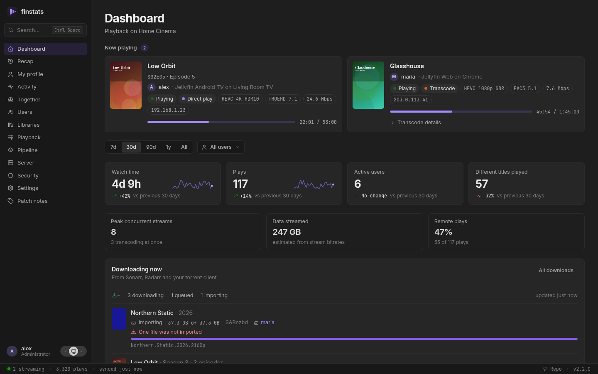
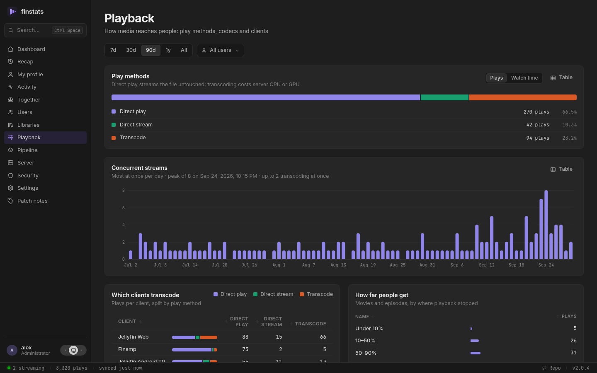
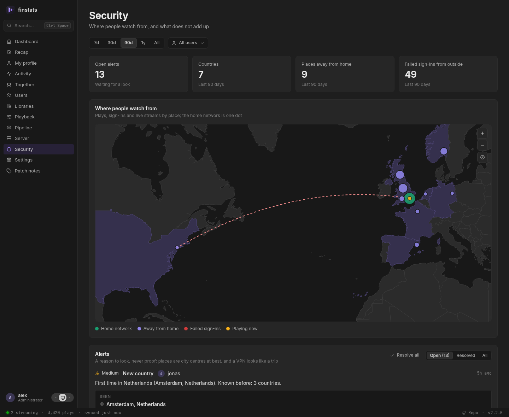
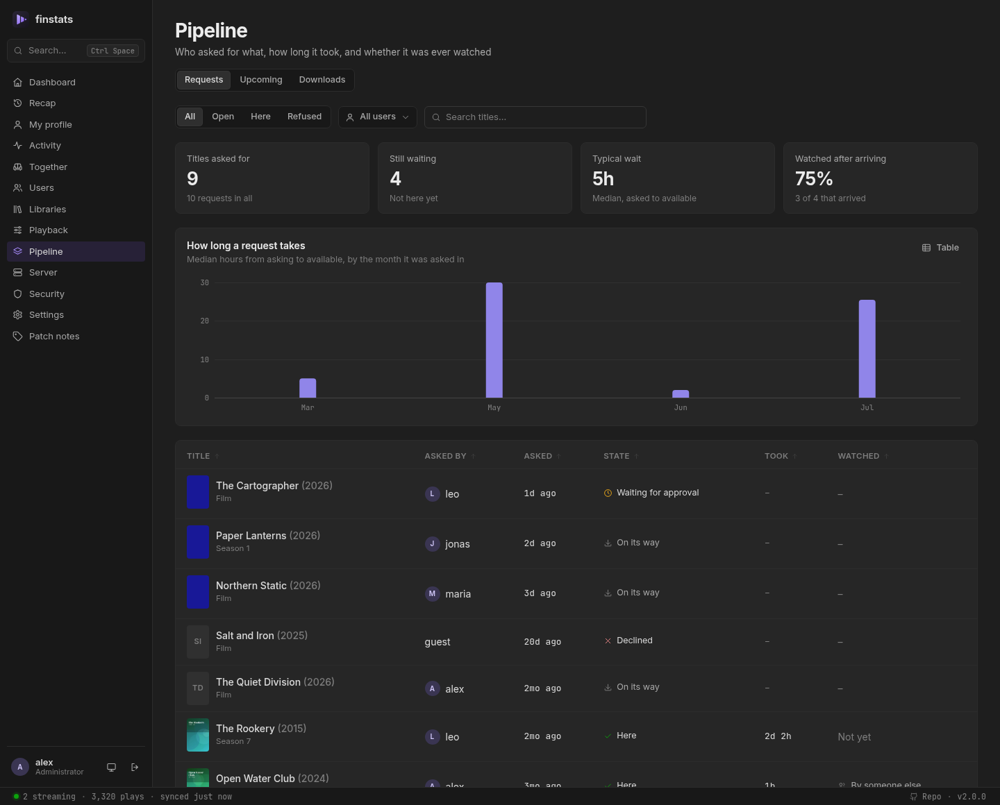
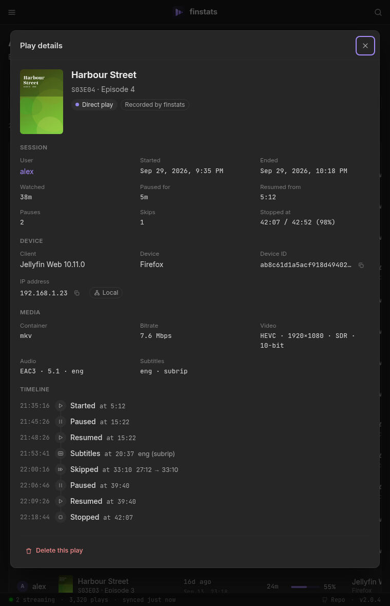
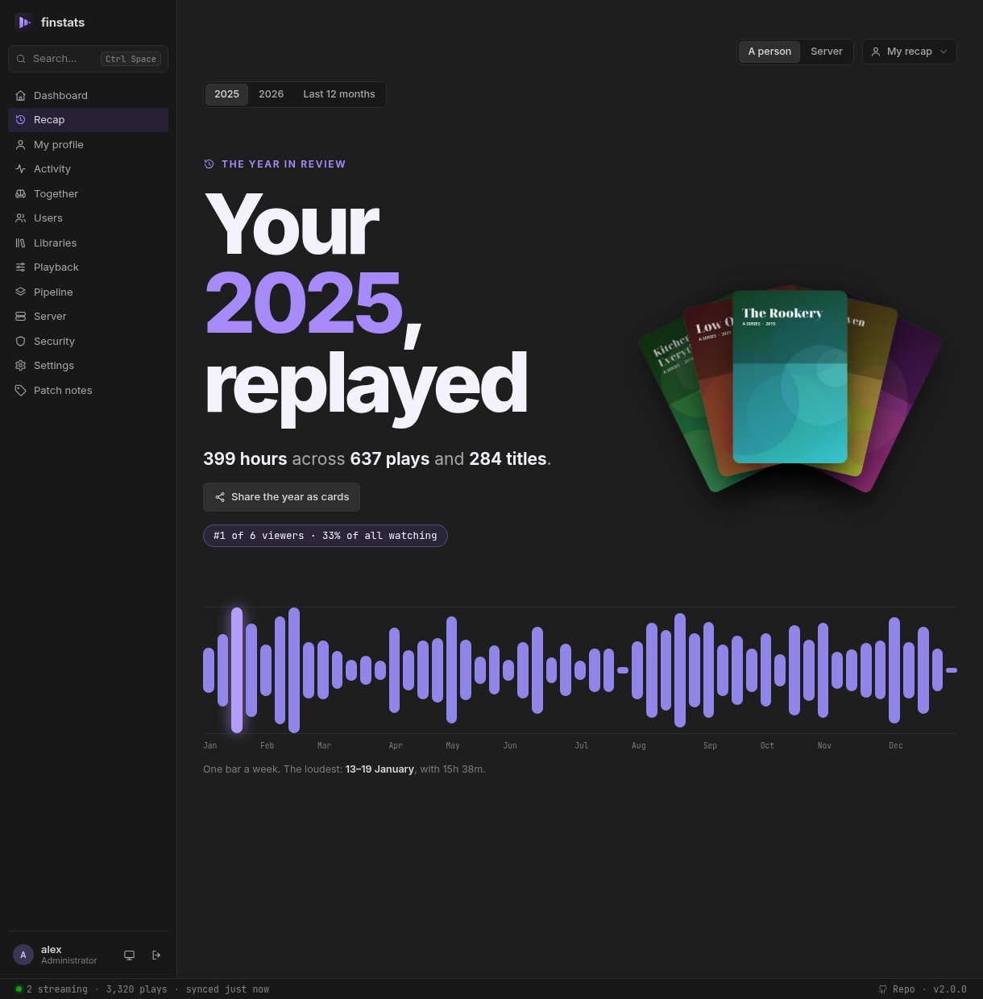
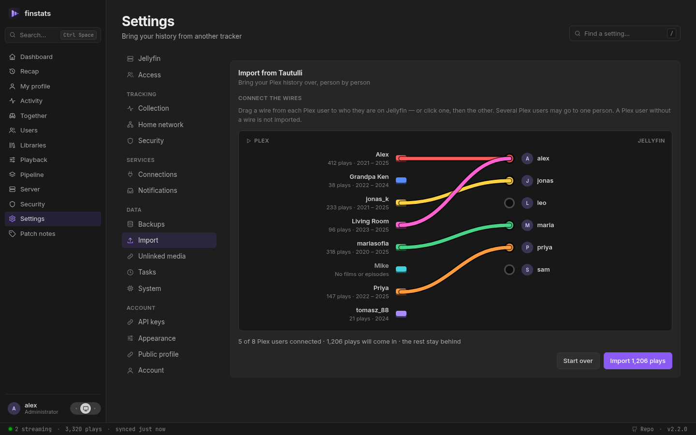

<p align="center"></p>
<h1 align="center">FinStats</h1>

<p align="center">
  <b>See what your Jellyfin server is really doing.</b><br>
  Who is watching, what they watch, how it streams, and your year in review.<br>
  One tiny container. No database server. Set up in two minutes.
</p>

<p align="center">
  <a href="https://demo.finstats.no/"><b>Try the demo</b></a>: FinStats in your browser, with invented people and titles. Nothing to install.
</p>

<p align="center">
  <a href="https://github.com/finstats/finstats/releases/latest"></a>
  <a href="https://github.com/finstats/finstats/pkgs/container/finstats"></a>
  <a href="https://github.com/finstats/finstats/actions/workflows/docker.yml"></a>
  <a href="LICENSE"></a>
</p>

<p align="center">
  
</p>

> **How FinStats is built: with AI assistance.** Most of the code here was written by Claude Code,
> working from the maintainer's design decisions and reviewed before it landed. Nothing is generated
> and forgotten: every change is written test-first, `cargo test` runs in CI on every push to `main`
> and on every release tag, and each release is run against a real Jellyfin server before it ships.
> Said plainly because you should know what you are running; the responsibility for this code is the
> maintainer's, not a model's.

## Why FinStats

Jellyfin tells you what is playing right now. It does not tell you that one client transcodes
everything it touches, that four people stream at once every Saturday, or that a third of your
disk is films nobody has ever pressed play on.

FinStats watches your server quietly in the background and turns that into answers. It is a
lightweight alternative to Jellystat and Streamystats: a single small program with its own
built-in database, using **under 100 MB of memory**, where each of those needs around half a gigabyte.
Nothing else to install, nothing to maintain.

Already using Jellystat or Streamystats, or coming from Plex with Tautulli? [Bring your history with you](#moving-from-jellystat-streamystats-or-tautulli). It takes seconds.

## What you get

### A live view of your server
See every stream as it happens: who, what, on which device and from where, whether it plays
directly or transcodes, and why. A status bar keeps the essentials in sight on every page.

### Answers, not just charts



- **How busy does it get?** Peak concurrent streams over time, and how many of them transcode.
- **Which apps cause transcoding?** Every client, split by direct play, remux and transcode, with the reasons Jellyfin reports.
- **How much leaves the house?** Local versus remote plays and an estimate of data streamed. FinStats knows your
  household's public address, so a phone on the Wi-Fi that goes through your public name still counts as home.
- **Do people finish what they start?** See how far viewers get before they stop.
- **Where do people give up?** Every film and episode draws the shape of it: the share still watching at each minute,
  so "68% stop at four minutes" reads as an opening-credits problem and a show says which episode people never come
  back after.
- **Where do people rewind, and when do the subtitles go on?** On the same chart: the spot several people skipped
  back to is where the dialogue is mumbled, and subtitles going on three minutes in is a finding about that file.
- **Which files are broken?** A title started three times that never got past thirty seconds is a bad remux or a
  missing codec, and FinStats says which apps tried, before a family member has to tell you it doesn't work.
- **Want it in a different order?** Every table sorts by any column with a click, and long ones can be filtered as you type.
- **Is it dubbed?** Every title shows the languages of its audio and subtitle tracks. A show says how far a dub goes
  ("English: 13 of 26 episodes"), and each episode lists its own, so you know before you start.
- **What is my library made of?** Resolutions, codecs, HDR, size per decade, what was added when,
  and the big one: **titles nobody has ever watched**, sorted by how much space they take.

### Is the library in order?
**Server → Library health** compares every file with its neighbours and lists what stands out, each with the numbers
that say so: episodes missing in the middle of a season, a season in another resolution than the rest of the show, one
720p episode in a 1080p season, the same film twice (and the space it takes), a file far too thin for the resolution it
claims, a dub that covers two seasons and not the third, and titles Jellyfin never matched with a catalogue. Set aside
what is fine on purpose, with a note; it comes back by itself if the files change. FinStats only reports: it never
deletes, rescans or fixes anything.

### Is that really them?



The **Security** page puts every play and sign-in on a world map: home is one dot, places away from
home another colour, streams running right now pulse, and failed sign-ins from outside show up in red.
When an account is somewhere it cannot be (home at eight, another continent twenty minutes later, or
two places at once), FinStats raises an *impossible travel* alert with both sightings, the distance and
the speed it would have taken; the first time someone shows up in a new country is flagged too. Mark a
VPN or a holiday as fine and it stays quiet. Addresses are looked up in a database file on your own
machine and the map is drawn by FinStats itself, so no address or coordinate is sent anywhere.

### What is coming in



FinStats can also watch the rest of your setup, read-only: **Sonarr**, **Radarr** and **Seerr**, several of a kind if you
have them. Your download client needs no setup of its own: Sonarr and Radarr already talk to it, and FinStats reads what
they know. The **Pipeline** page then answers the questions statistics alone cannot:

- **Was it worth getting?** Every request with who asked, how long it took to arrive, and whether they ever watched it,
  plus the list nobody likes to see: what arrived weeks ago and has never been played.
- **What is coming?** A calendar of new episodes and film releases, marked with who is actually watching that show, so a
  Friday episode of something three people follow stands out from one nobody has touched in a year.
- **What is arriving right now?** The live queue with progress, speed and what went wrong on import, plus what came in
  over the last week, month or year, by indexer, quality and download client.

Your own requests are yours to see; other people's need a permission, and the download queue another. API keys are stored
in FinStats' own database, are never shown again, and are never part of a backup.

### Every play, down to the pause button



Other tools store one line per play. FinStats records what happened *during* it: every pause and
resume, every skip, audio and subtitle switches, the moment a direct play turned into a transcode,
where playback picked up and where it stopped.

Alongside the usual details: device, app version, IP address and whether it was on your network,
video and audio format, bitrate, time watched versus time paused.

Every film and show lists its cast and crew, and every actor and director has a page of their own:
what they are in on your server, and how much of it has been watched.

Renamed a file? Jellyfin treats it as a new item and orphans its history. FinStats notices and
re-attaches the old plays to the new entry.

### Who watches together
When two or more people press play on the same thing at the same time, FinStats notices: which
groups watch together, what they watch, and how many hours they have spent doing it. It shows on
the dashboard, on each profile ("most often with"), and as a small mark on every shared play. The
**Together** page has the whole of it: who watches with whom, hours in company against hours alone
over time, each person's share, and the recent evenings. An evening of three counts for each of its pairs.

### Use it from outside
Everything the pages know, a script can ask. Make a key under **Settings → API keys** and send it as a header:

```sh
curl -H "Authorization: Bearer fs_…" https://finstats.example/api/stats/overview?days=30
```

A key is you: it sees what you may see and no more, dies when your access does, and is shown once. Make one
with the *calendar* scope and your phone can subscribe to **what is coming**: every episode and film Sonarr
and Radarr expect, as a calendar you carry with you, without that key opening anything else. And every change
made in FinStats (a sign-in, a setting, a key, a backup, an import) is on record under **Server → Audit**,
with who did it and from where.

### Where you are in every show
Your profile shows each series as a bar with one segment per episode: seen, started, or not yet.
Only episodes that are actually on your server count, so an announced season does not spoil a
finished show. Watched something while nothing was recording? Jellyfin's own played marks fill the
gap, and you can mark episodes, seasons or whole shows as seen yourself. Alongside it: your longest
and current day streak.

<br clear="right">

### A watchlist of your own
Put a film or a show on your watchlist from its page (an episode's page offers its show), from Upcoming, from Recently added or from search,
even one that is not on your server yet, straight from what Sonarr or Radarr is waiting for. Every entry
says where it stands now: on the server, 5 of 26 episodes, requested, coming up Friday, or watched. When
something you were waiting for arrives, FinStats can tell you. Nobody else sees your list, an administrator
included, and nothing is written to Jellyfin, Seerr, Sonarr or Radarr.

### Your year in review



A personal recap for every user, in the spirit of Spotify Wrapped: hours watched, top shows, movies,
music and genres, the actors and directors you spent the most time with, and a viewing
personality: night owl, weekend warrior, binge watcher and more. See the whole year as a calendar
of days, find out which weekday took the crown, and collect the records worth bragging about:
biggest binge, longest daily streak, most rewatched title, the oldest film you watched. Since 2.0 it
also tells you who you watched with, which shows you finished (and which you left for later), what you
asked for through Seerr and what came of it, and how the year compares with the one before.

**Share it as a story.** Every chapter is also a 1080×1920 card, the shape phone stories use: save one,
or all of them as a ZIP. A card never names anybody else: the people you watched with are named in
the app and nowhere that leaves it. Publish your year on your public profile and anyone with the link
sees the same cards. In December, when the year is ready, FinStats can tell you so.

Each person sees only their own. Administrators can open another person's recap, and the whole server's
year (titles and totals, nobody ranked or named); nobody else can, whatever permissions they hold.

### Share it, if you want to

A person can publish part of their profile at a link that opens without an account (totals and top
titles, streaks and when they watch, the year, the last few plays), and every link comes with a card
that chat apps show when it is pasted. It is off until an administrator allows it, each part is off
until its owner turns it on, and nothing on it is newer than a day, so a published page never says
who is watching right now. Devices, addresses, apps and file paths are never published, whatever is
switched on. The link is random, and resetting it is how you take back one already sent.

### Private by design
- **Sign in with your Jellyfin account.** No new passwords, and FinStats never stores yours.
- **Nothing is readable without an account** unless an administrator allows public profiles and a person
  publishes one, and then only what that person switched on, a day late, never a device, address or path.
- **You decide who sees what.** Let family and friends sign in if you like. By default they get
  their own statistics and recap and nothing else. From there you grant more, per person or for
  everyone: other people's activity, network details like IP addresses, the server pages, or
  managing FinStats itself. No permission opens other people's recaps or watchlists.
- **Nothing about you leaves your network.** No telemetry, no accounts, no fonts or scripts loaded
  from the internet. Posters are fetched from your own Jellyfin. The one outside request FinStats
  makes by default is a plain "what is my IP" lookup, asked **once**, so that people watching at home
  through your public address are not counted as remote, and after that never again unless you press the
  button. It carries no information about you or your server, and one switch in Settings turns it off.
  **Settings → System → Outbound connections** lists every destination FinStats can reach and whether it is
  switched on, so the promise is one you can check rather than one you have to take. The Security map needs a geolocation database; downloading it is
  off until you ask for it, and addresses are always looked up on your own machine. Sonarr, Radarr, Seerr and torrent
  are reached at the addresses you enter, on your own network.
- **Notifications go where you send them, and nowhere else.** FinStats can tell you when something happens
  (in a Discord or Slack channel, a Telegram chat, an e-mail, Pushover, Pushbullet, ntfy, Gotify, or a webhook of
  your own), and until you add a destination it sends nothing at all. Each destination is told only the kinds of event you tick for it, and IP addresses and coordinates stay
  out of the messages unless you switch them in for that one destination. Every destination is listed under
  **Outbound connections** with the rest.
- **Read-only.** FinStats never changes anything on your Jellyfin server and never starts a library scan. The same goes for
  the services you connect (Sonarr, Radarr, Seerr): it reads, and that is all.

## Get started

You need Docker and a Jellyfin server (10.9 or newer).

```sh
docker run -d --name finstats --restart unless-stopped \
  -p 8080:8080 \
  -e TZ=Europe/London \
  -v "$PWD/data:/data" \
  ghcr.io/finstats/finstats:latest
```

<details>
<summary>Prefer Docker Compose?</summary>

```yaml
services:
  finstats:
    image: ghcr.io/finstats/finstats:latest
    container_name: finstats
    restart: unless-stopped
    ports:
      - "8080:8080"
    environment:
      TZ: Europe/London   # your timezone
    volumes:
      - ./data:/data
```

</details>

The image is published for 64-bit Intel/AMD and ARM machines (a Raspberry Pi 4 or 5 works) at
[`ghcr.io/finstats/finstats`](https://github.com/finstats/finstats/pkgs/container/finstats). `:latest` is the newest release;
pin a version such as `:2.0.0`, or `:2` for every 2.x update, if you prefer to choose when to upgrade. `:edge` follows
development and may be rough.

Then open **http://your-server:8080** and:

1. Enter your Jellyfin address and test the connection.
2. Sign in with a Jellyfin administrator account.

That's it. FinStats starts watching immediately and fills in your library in the background. The `data` folder is
created for you; FinStats makes it its own and then runs as an ordinary, unprivileged user (1000:1000, or whatever
you set with `PUID` and `PGID`).
Set `TZ` to your own timezone so "today" and "evening" mean what you expect.

> Inside a container, `localhost` is the container itself. Use your server's address
> (for example `http://192.168.1.10:8096`) or the Jellyfin container's name.

## Moving from Jellystat, Streamystats or Tautulli

Your history comes with you, from any of them.

**Jellystat:**

1. Open **Settings → Backup**
2. Select only **Activity** (it turns purple)
3. Under settings click **Settings**, scroll to the end and start a backup
4. Go back to **Backups**, open **Actions** on the new backup and click **Download**

**Streamystats:** open **Settings → Backup & Import**, scroll down to **Backup & Restore** and
click **Download Backup**.

**Tautulli** (coming from Plex):

1. Open **Settings → Import & Backups** and click **Backup Database**. Tautulli saves the backup on
   the machine it runs on; nothing downloads to your browser.
2. Find it in Tautulli's `backups` folder, inside its data folder. With Docker that is `backups` inside
   the folder you mounted as `/config` (for example `/opt/tautulli/config/backups`); with a native
   install, inside the data folder Tautulli was installed with.
3. Take the newest `tautulli.backup-….db` or `….db.zip` (the scheduled ones, `….sched.db.zip`, work
   the same). Leave the `config.backup-…` files: they are Tautulli's settings, not its history.
4. Copy it to the computer you are using, with `scp`, a shared folder or your NAS's file manager.

In FinStats, open **Settings → Import**, find the card for the one you used, and drop the file in.



**From Tautulli you say who is who.** Plex names rarely match Jellyfin's, so the upload becomes a
wiring board: Plex users on one side, Jellyfin users on the other. Drag a wire from each Plex user to
who they are now, or click one, then the other. Anybody you leave unwired is not imported, and two
Plex accounts can go into one person. Films and episodes are matched to your library by name; music
is left out. Anything it cannot place (a film Plex called something else) waits under **Settings → Unlinked media**
with its likeliest match already found, one **Locate** away.

**Ran both?** Import both files. Nothing is counted twice: FinStats recognises a play it already
has, whichever tracker brought it in and whether or not it watched that evening itself.

Large backups are no problem (a 350 MB file imports in a few seconds), and importing the same file
twice is safe. One thing to know: neither tracker recorded what happens *during* a play, so imported
history has no pause-and-skip timelines. Everything FinStats records from now on does.
[How Jellystat data is interpreted →](docs/jellystat-import.md) ·
[How Streamystats data is interpreted →](docs/streamystats-import.md) ·
[How Tautulli data is interpreted →](docs/tautulli-import.md)

## Settings

Everything works out of the box. If you want to tune it, **Settings** in the app has:

| | |
|---|---|
| **Access** | Who may sign in and what they may see, for everyone or per person: *sign in*, *see everyone's activity*, *see network details*, *see the server*, *manage FinStats*. Jellyfin administrators always have everything, and only they can change this. |
| **Jellyfin's address for people** | Where every title's *Open in Jellyfin* button points: your Jellyfin's address from outside, when that is not the one FinStats connects to (a container name, a LAN address). Empty: the address FinStats connects to. Jellyfin administrators only. |
| **API keys** | Your own keys for scripts and calendars, with a scope and an expiry; shown once, revoked with a click. Every signed-in user has this section; administrators see everyone's keys. |
| **Tasks** | Every job FinStats does by itself, when it last ran and how long it took, and (one click away) its schedule, the way Jellyfin schedules its own: daily, weekly, on an interval, at start-up, or after Jellyfin's library scan (the default for the library read), each with an optional time limit. |
| **Check every…** | How often FinStats asks what is playing: every second while someone is watching, and, only while the live connection is not carrying, every 5 seconds while nobody is. Jellyfin pushes a new play within about a second, so the second one is a fallback and nothing more. |
| **Treat a restart as the same play** | A stream that stops and resumes within 10 minutes counts as one viewing. |
| **Home network** | Which plays count as local. Private addresses always do; with *Recognise my own public address* on (the default), so does your household's public IP, looked up **once** and remembered. *Look up now* asks again on the day it changes; you can also add addresses by hand. |
| **Connections** | Sonarr, Radarr and Seerr, several of a kind if you have them. Each is tested before it is saved; API keys are never shown again and never part of a backup. Jellyfin administrators only. |
| **Security** | The city database that places addresses: download DB-IP's free one with a click and keep it fresh with a schedule under *Tasks*, or drop your own `.mmdb` into `data/geoip/`. Also how fast (900 km/h) and how far apart (500 km) two sightings must be to count as impossible travel. |
| **Count it as watching together within** | How close together different people must start the same title to count as a group. Default 60 seconds. |
| **Ignore plays shorter than** | Leave accidental clicks out of the statistics. |

<details>
<summary>Environment variables</summary>

| Variable | Default | |
|---|---|---|
| `TZ` | UTC | Your timezone, for per-day and hour-of-day statistics. |
| `FINSTATS_BIND` | `0.0.0.0:8080` | Address to listen on. |
| `FINSTATS_DATA_DIR` | `/data` | Where the database and poster cache live. |
| `PUID`, `PGID` | `1000` | The user and group FinStats runs as inside the container, and that will own the `data` folder. Set them to the owner of your files if that is not 1000. (`--user` works too; the folder must then already be writable for that user.) |
| `FINSTATS_TRUST_PROXY` | off | Set to `1` behind a reverse proxy so sign-in rate limiting sees real client addresses: the last `X-Forwarded-For` entry, the one your proxy adds. |
| `JELLYFIN_URL` + `JELLYFIN_API_KEY` | – | Skip the setup wizard. Set both or neither. |
| `FINSTATS_PUBLIC_IP_URL` | – | Your own "what is my IP" service (any URL answering with the caller's address as plain text), used instead of the built-in ones. |
| `FINSTATS_GEOIP_DB` | – | A city database (`.mmdb`, MaxMind format) to place addresses with, instead of the newest file in `data/geoip/`. |
| `FINSTATS_ALLOW_LIBRARY_SHRINK` | off | Let a sync mark items, libraries or users removed even when the read comes back far emptier than what FinStats holds. Off by default: such a read is treated as a Jellyfin fault, the data is kept, and FinStats stops so you can look. Set to `1` after genuinely emptying a library. |
| `FINSTATS_SKIP_PREUPDATE_BACKUP` | off | Skip the automatic full-database backup FinStats takes when a newer version first opens your data. On by default; the copy lands in `data/pre-update-backups/` before any upgrade touches the database, so you can roll back if something breaks. Set to `1` only if disk space is tight. |
| `RUST_LOG` | `finstats=info` | Log detail, e.g. `finstats=debug`. |

</details>

## Moving FinStats to another machine

Download a backup under **Settings → Backups**, set up the new FinStats, and restore the file on its
**Settings → Backups** page (or `finstats restore <file>`). Restoring merges, so nothing is lost if the new
instance has already been collecting. The library is read from Jellyfin again by itself.

## Updating

```sh
docker pull ghcr.io/finstats/finstats:latest
docker rm -f finstats
# …then the same `docker run` as above. With Compose: docker compose pull && docker compose up -d
```

Your data lives in the `data` folder and upgrades itself on start-up; FinStats also keeps its own weekly
backups there. After an update, the **Patch notes** tab shows a dot until you have read what changed. The same
notes are on the [releases page](https://github.com/finstats/finstats/releases) and in [CHANGELOG.md](CHANGELOG.md).

Updates only go forward. The database remembers the newest version that has opened it, and an older FinStats
refuses to start on it rather than risk your history; the message says how to get going again. To really go back to
an older version, start it on an empty data folder and restore one of the backups (`finstats restore <file>`).

## Questions

**Does it slow Jellyfin down?**
No. Jellyfin tells it when something starts, over one connection that stays open, so an evening
when nobody is watching costs no requests at all. While something is actually playing it asks one
small question a second, which is what keeps pauses and skips exact, and it reads your library only
after Jellyfin has finished its own scan.

**Where is my data, and how do I back it up?**
FinStats backs itself up every week into `data/backups` and keeps the newest five; download them under
**Settings → Backups**, where you can also restore one into a new install. A backup has your whole history,
settings and permissions, but never your Jellyfin API key. The database itself is the single file `data/finstats.db`.

**It says "cannot write to its data directory".**
The `data` folder belongs to a different user than the one FinStats runs as. This happens when you start the
container with `--user` (or `user:` in Compose) on a folder Docker created as root. Either drop that setting, so
FinStats can fix the folder itself, or run `sudo chown -R 1000:1000 ./data`.

**Can I put it behind a reverse proxy?**
Yes. Forward to port 8080 and set `FINSTATS_TRUST_PROXY=1`. Sign-in cookies are marked secure
automatically when the proxy reports HTTPS.

**How do I start over?**
Stop the container, delete the `data` folder, start it again. To clean up fully, also remove the
`finstats` API key in Jellyfin (Dashboard → API Keys).

**Is it safe to expose to the internet?**
It is built for it (Jellyfin-backed sign-in, rate limiting, hashed sessions, a strict content
security policy), but like anything self-hosted, a reverse proxy with HTTPS is strongly
recommended. [Security details →](docs/security.md)

## For developers

FinStats is written in Rust with a dependency-free web UI compiled into the binary. The interface follows the
UX patterns collected at [uxgoodpatterns.com](https://uxgoodpatterns.com): forms that validate on submit, dialogs
that close three ways, tables you can sort, states for loading, empty and failed.

```sh
git clone https://github.com/finstats/finstats.git && cd finstats
cargo build --release
FINSTATS_DATA_DIR=./data ./target/release/finstats
cargo test
docker build -t finstats:dev .          # your own image instead of the published one
```

Found a bug or have an idea? [Open an issue](https://github.com/finstats/finstats/issues/new/choose); found a security
problem? [Report it privately](SECURITY.md). Questions go to
[Discussions](https://github.com/finstats/finstats/discussions). Everyone taking part follows the
[code of conduct](CODE_OF_CONDUCT.md).

- [Contributing](CONTRIBUTING.md): reporting bugs, what fits the project, running it from source or in a local Docker setup, the rules for a change, pull requests
- [HTTP API](docs/api.md): the contract the web UI is built on
- How [Jellystat](docs/jellystat-import.md), [Streamystats](docs/streamystats-import.md) and [Tautulli](docs/tautulli-import.md) data is interpreted
- [Security model](docs/security.md)
- [Patch notes](CHANGELOG.md)

The database holds your users, their IP addresses and your Jellyfin API key, and a Jellystat or
Streamystats backup is a complete viewing history. All of them are ignored by git. Before
contributing, switch on the bundled commit guard as a second lock:

```sh
git config core.hooksPath .githooks
```

## License

FinStats is free software under the [GNU General Public License v3.0](LICENSE). You may use,
study, share and change it; if you distribute a modified version, it has to stay under the same
license with its source available. It comes with no warranty.

The bundled fonts (Inter and JetBrains Mono, and those a FinUI preset may choose in Settings → Appearance) are under
the SIL Open Font License 1.1; each one's licence sits beside it in [`web/assets/fonts`](web/assets/fonts) and is listed on
the in-app Licences page.

<sub>Screenshots show generated demo data: invented users, titles and artwork.</sub>
